# Preparing Discovery Production and RFP CSV

This walkthrough shows how to export a CSV from the discovery platform that works with Discovery Bates Converter.

Screenshots for this walkthrough live in `frontend/public/images/rfp` and are served by the app from `/images/rfp/...`.

The converter expects this layout:

- Column `A`: `Begin Bates`
- Column `B`: `End Bates`
- Column `C` and beyond: one `Tag: RFP ...` column per request
- Responsive rows marked with `TRUE` in the matching RFP column

## 1. Save a locked production search

Start from the production set you want to export and save it as a search. Use a clear name, lock the search, and keep the production family settings you normally use for export. Note: this is where paralegals need to check orphan files.

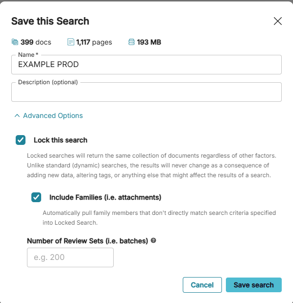

## 2. Select the production search

Pick the search you just created and locked.

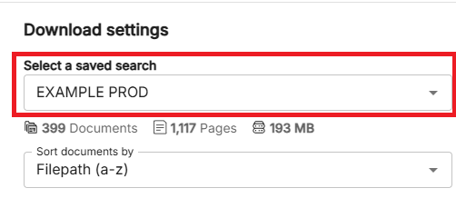

## 3. Create an advanced sort for the RFP tags

Create a new advanced sort.

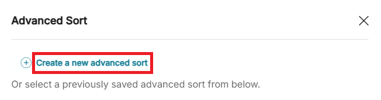

Group the results by `Tags`, then add each `RFP` tag you want represented in the CSV. Keep the RFP tags in the same order you want them to appear in the export.

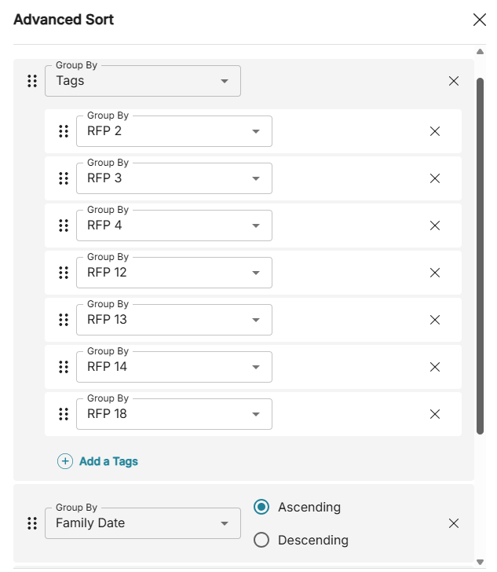

## 4. After running production, search the download you created

From the download page, open the saved search so you are working from the exact document set you want to export.

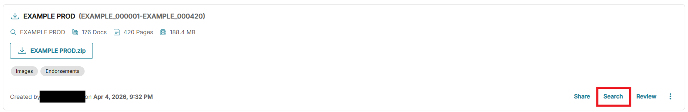

## 5. Start a CSV export

With the saved search open, click `CSV` to create a CSV download in the top right.

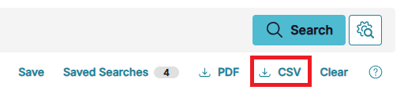

## 6. Create a new export template

In the CSV download dialog, create a new template instead of reusing a template that may have extra fields in the wrong order.

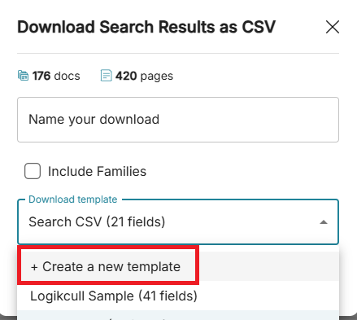

## 7. Add Bates fields first

Search for `bates` and add these two fields first:

- `Begin Bates num from ...`
- `End Bates num from ...`

These must be the first two columns in the final CSV.

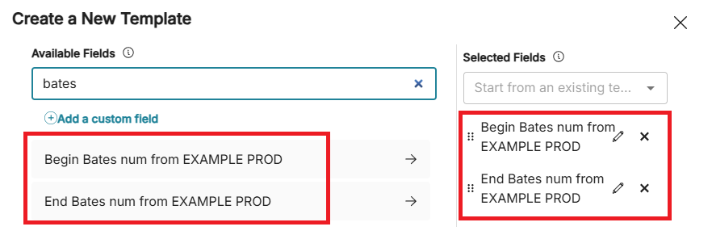

## 8. Add the RFP tag fields after the Bates columns

After the Bates fields, add each `Tag: RFP ...` field you want to export. Keep the RFP columns in the order you want the converter to use.

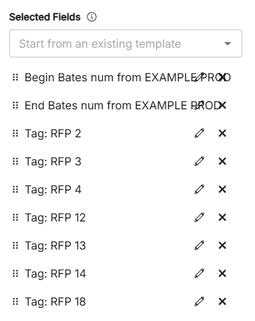

## 9. Name the download and create it

Give the CSV a simple name, confirm the template is selected, and click `Create CSV Download`.

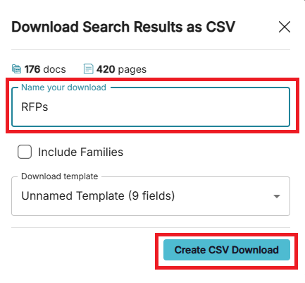

## 10. Download the finished CSV

When the export is ready, click the download link for the CSV file.

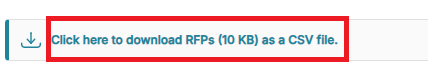

## 11. Verify the final column layout

Before running the converter, open the CSV and confirm:

- Column `A` is `Begin Bates`
- Column `B` is `End Bates`
- The remaining columns are the `Tag: RFP ...` fields
- Matching documents show `TRUE` in the appropriate RFP column

This is the format the converter expects.

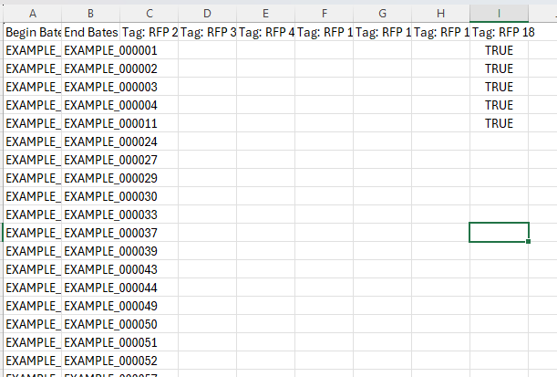
